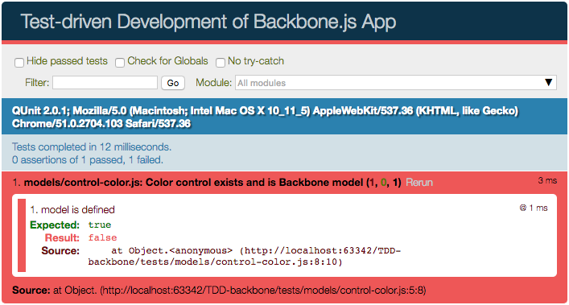
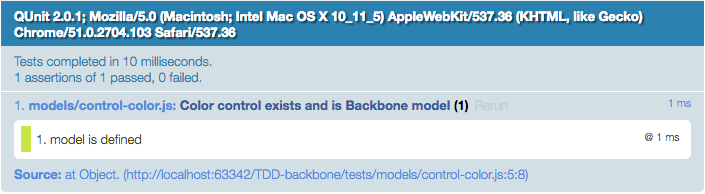

Test-driven Development of a Backbone.js App
===

##### Implementing test-driven development (TDD) principles based on a QUnit testing suite.

In one of the projects I worked on recently, there was a requirement to accompany our JavaScript code with unit tests.
That is when I thought to myself that it would be a good idea to give test-driven development a try.
But right then, a voice in my head said:

> Nah! Writing unit tests first having no implementation seems unreasonable. Plus – in TDD I have to write unit tests for each and every module, not only the crucial ones. This means more code, and more time needed.

Luckily, at the time I stumbled upon [an excellent series of articles by James Sinclair](http://jrsinclair.com/articles/2016/gentle-introduction-to-javascript-tdd-intro/) (for me a must-read for anyone wanting to step into TDD).
The author shows test-driven development in a very interesting way.
James Sinclair states that in TDD the programmer is more confident in his code while the development process is both efficient and enjoyable to the coder!

How is it so? Boring unit testing being fun to the developer?
Now I just had to give TDD a try!

TDD Fundamentals
---

As you probably already know from [James Sinclair’s post](http://jrsinclair.com/articles/2016/gentle-introduction-to-javascript-tdd-intro/), each step in test-driven development is split into 3 phases:

1. **Red** – write always-failing test.
2. **Green** – write the simplest-possible implementation for the failing test.
3. **Refactor** – rewrite implementation code in order to optimise and simplify the solution.

Always start with writing a failing test in the **red** phase.
It will prevent your unit test from being erroneous (e.g. having always-passing test or trying to implement functionality that is already there).

Then write the simplest solution (even if it seems dumb) in **green** phase.
Your aim is to write code that just passes the test.
This way your implementation will stay lean, without any unnecessary code left here and there “just in case”.

Having the green light, you should go back to the implementation and **refactor** each snippet you feel could be written better.
Please keep in mind your testing code is nothing you should be ashamed of. It deserves refactoring too!

Everything seems to be working well now?
Rinse and repeat those 3 steps until you feel all requirements are satisfied for that particular module.

Sounds fairly simple? Let’s try to illustrate the process with an example then.

Using TDD to Create a Front-end Filtering Module
---

Imagine we are writing a simple filtering module for an online store.
It consists of a set of checkboxes representing available color options for a product.
Besides color options, the module should have one additional checkbox labelled ‘all’, which would be the option selected by default.
When clicking on any other checkbox, the ‘all’ option should get unchecked.
On the other hand, after clicking the ‘all’ option, all other checkboxes should get unchecked.

We will need a model to store the control’s state and to apply the business rules.
The model has to be accompanied by a view which will render the actual checkboxes, update their state in response to model’s data change and listen to events triggered by the user.

I decided to use the [Backbone.js](http://backbonejs.org/) library as the module’s foundation.
Why Backbone? Because it is mature, popular, lightweight and already included in WordPress Core.
If you’re new to the Backbone.js or would like to learn more about it, I recommend [“Backbone Fundamentals”](https://addyosmani.com/backbone-fundamentals/) – a great open-source book by Addy Osmani.

For a unit testing framework, I have used [QUnit](http://qunitjs.com/).
If you haven’t used QUnit before, I suggest going straight to [Cookbook section](http://qunitjs.com/cookbook/) on their website to quickly get to know more about it.

Setting Up the Project
---

Our project structure looks like this:

```
src
├─ models
|  └─ control-color.js
├─ views
|  └─ control-color.js
└─ tests
   ├─ models
   |  └─ control-color.js
   ├─ views
   |  └─ control-color.js
   └─ test-runner.html
```

Here’s our `test-runner.html` file:

```html
<!DOCTYPE html>
<html>
  <head>
     <meta charset="utf-8">
     <meta name="viewport" content="width=device-width">
     <title>Test-driven Development of Backbone.js App</title>
     <link rel="stylesheet" href="https://code.jquery.com/qunit/qunit-2.0.1.css">
  </head>
  <body>
     <div id="qunit"></div>
     <div id="qunit-fixture"></div>
     <script src="https://code.jquery.com/jquery-2.2.4.min.js"></script>
     <script src="https://code.jquery.com/qunit/qunit-2.0.1.js"></script>
     <script src="https://cdnjs.cloudflare.com/ajax/libs/underscore.js/1.8.3/underscore-min.js"></script>
     <script src="https://cdnjs.cloudflare.com/ajax/libs/backbone.js/1.3.3/backbone-min.js"></script>
     <script src="../src/models/control-color.js"></script>
     <script src="../src/views/control-color.js"></script>
     <script src="models/control-color.js"></script>
     <script src="views/control-color.js"></script>
  </body>
</html>
```

Up until now all test and source files were empty.
It’s time to create our first test module.
We will test color control model, so in `tests/models/control-color.js` we should define our first module and test:

```javascript
QUnit.module( 'models/control-color.js', function() {
  QUnit.test( 'Color control exists and is Backbone model', function( assert ) {
     var Model = window.ControlColor;
     assert.ok( ! _.isUndefined( Model ), 'model is defined' );
  } );
} );
```

After opening `test-runner.html` in a browser, we will see that the only test we have so far is failing:



Since the `src/models/control-color.js` file is empty and we haven’t defined `ControlColor` object anywhere else, there’s no way this test could pass.

It’s time to move from **red** to **green** phase.
The simplest way to make the test pass is to define `ControlColor` object in the source folder, so after writing the single line of code:

```javascript
window.ControlColor = {};
```

in `src/models/control-color.js` file, the test should pass.
And it does:



Now it’s time for **refactoring**.
However, since the code we have written so far is really simple, there’s nothing to optimise.

---

In the next part of the series we will create a Backbone.js model. **[Continue reading...](./tutorial-part2.md)**